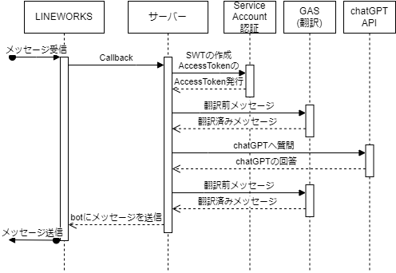
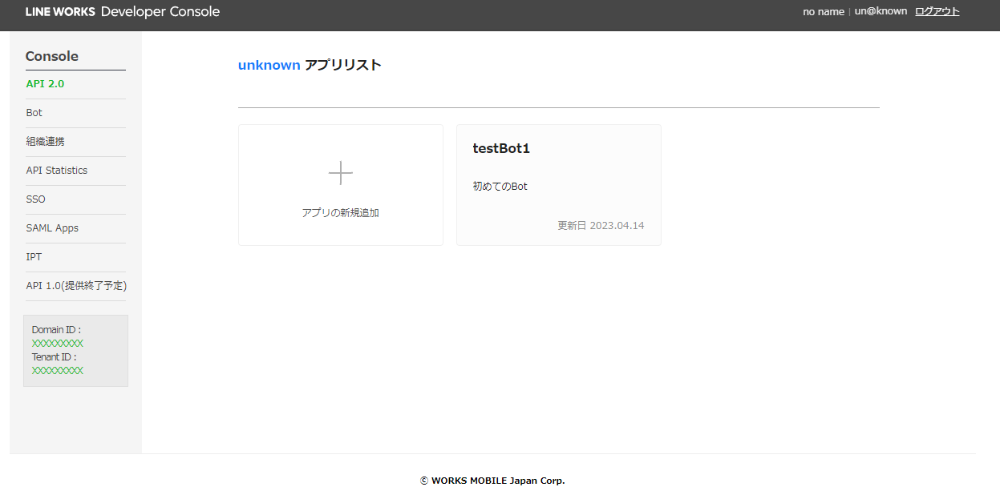
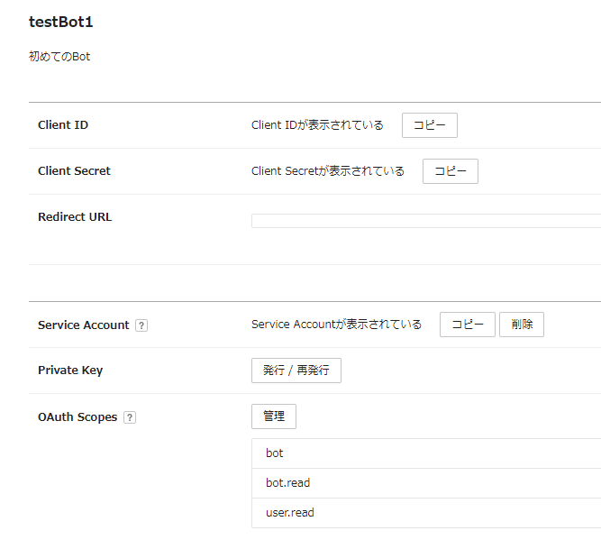
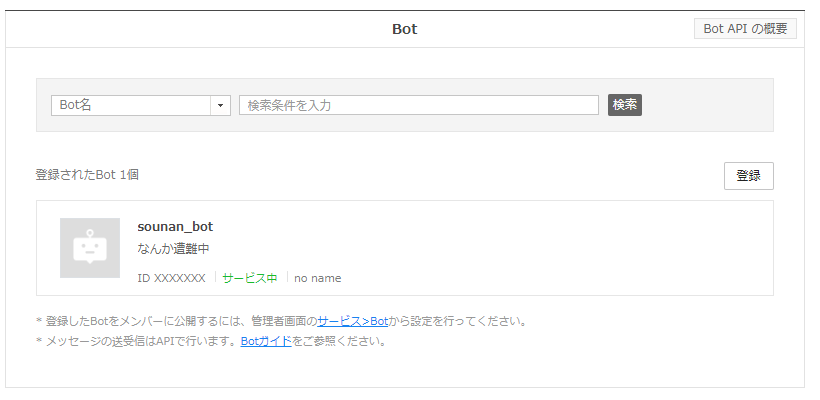
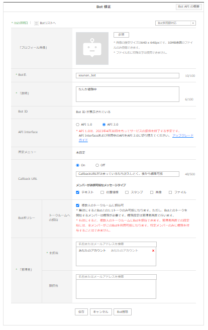
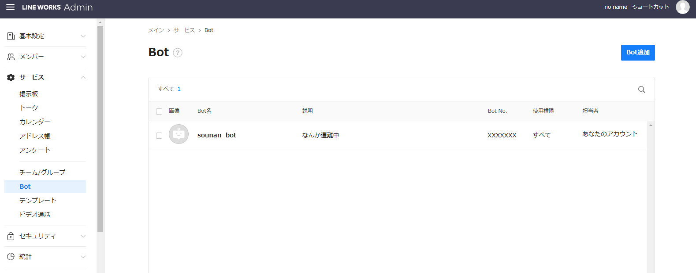
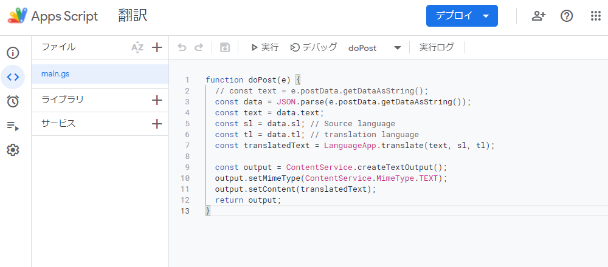
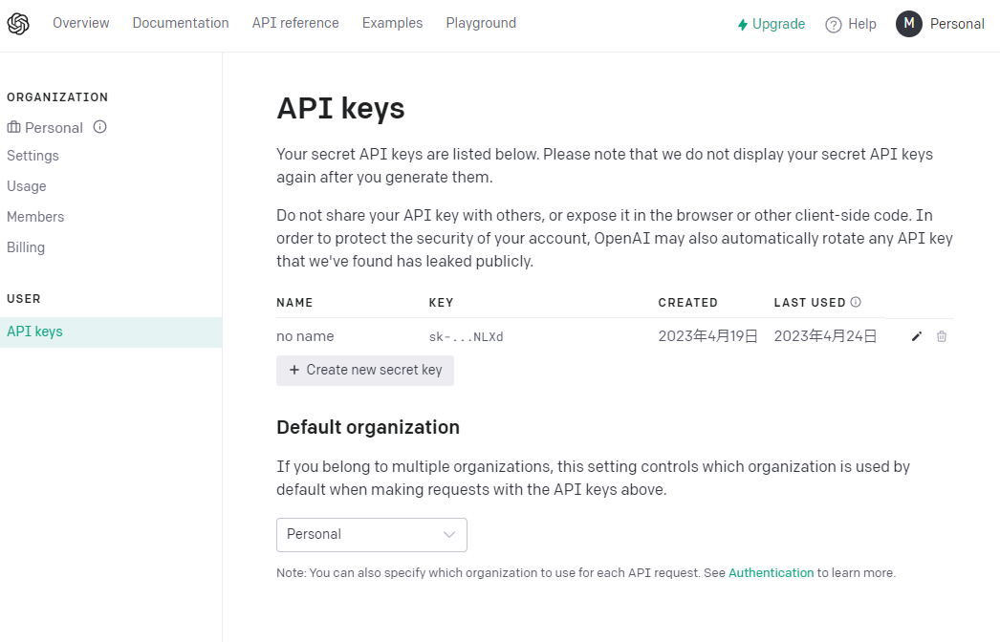
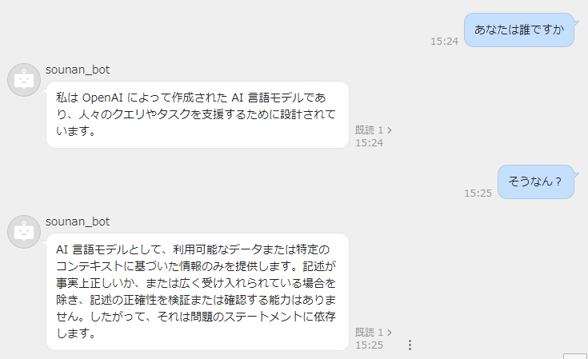

# LINEWORKS × chatGPT

## 目次

- [LINEWORKS × chatGPT](#lineworks--chatgpt)
  - [目次](#目次)
  - [概要](#概要)
  - [環境](#環境)
  - [ディレクトリ構成](#ディレクトリ構成)
  - [シーケンスダイアグラム](#シーケンスダイアグラム)
  - [導入方法](#導入方法)
    - [botを作ってLINEWORKSに招待する](#botを作ってlineworksに招待する)
    - [GASの準備](#gasの準備)
    - [openAi API準備](#openai-api準備)
    - [サーバー側準備](#サーバー側準備)
  - [使用方法](#使用方法)
  - [テスト方法](#テスト方法)
    - [get\_token.php](#get_tokenphp)
    - [yamabiko.php](#yamabikophp)
    - [trance\_lang.php](#trance_langphp)
    - [reqGPT.php](#reqgptphp)
    - [index.php](#indexphp)
  - [参考資料](#参考資料)

## 概要

LINEWORKSとchatGPTの連携を試してみた。  
LINEWORKSのbotを利用してchatGPTをLINEWORKSで使えるようにした。

## 環境

| サーバー環境 | 言語 | LINE WORKS API | chatGPT       |
| :-----------: | :--: | :------------: | ------------- |
| Apache/2.4.54 | php |      2.0      | gpt-3.5-turbo |

## ディレクトリ構成

```
test/
　　┣.htaccess
　　┣get_token.php
　　┣index.php
　　┣private_XXXXXXXXXXXXXX.key
　　┣reqGPT.php
　　┣trance_lang.php
　　┗yamabiko.php
```

- .htaccess：ウェブサーバーの設定を定義するファイルです。testを外から見えないようにするためなので各自サーバーに合わせて変更してください。
- get_token.php：JWTを作成し、AccessTokenを取得するプログラムです。
- index.php：メインのphpファイルであり、実際の動作ではこれだけしか動かしません。
- private_XXXXXXXXXXXXXX.key：LINEWORKS Developer Consoleから取得してきたPrivateKeyです。
- reqGPT.php：chatGPTに質問するプログラムです。
- trance_lang.php：質問と返答の言語を翻訳するプログラムです。
- yamabiko.php：LINEWORKSのbotにコメントさせるプログラムです。


## シーケンスダイアグラム



Token節約のためGASによる翻訳作業がchatGPTの処理の前後にくる。  
AccessTokenは24時間有効なのでどこかで保存しておけばわざわざ毎回処理する必要はないが、今回は特に気にしないのでそのまま入れた。

## 導入方法

前提として以下の事が出来ている状況とする。

- LINEWORKSでアカウント作成済みであり、Bot追加が可能である。
- BotのCallBackを受けるためのサーバーがある。
- Googleアカウントを持っている。
- chatGPTを使うためのアカウントを持っている。

### botを作ってLINEWORKSに招待する

まずはLINEWORKS Developer Consoleでアプリを作成します。

LINEWORKS Developer Console  
[https://developers.worksmobile.com/jp/console/openapi/v2/app/list/view](https://developers.worksmobile.com/jp/console/openapi/v2/app/list/view)



アプリの新規作成からアプリを作成します。  
アプリ名、アプリの説明は適当に記入。  
RedirectURLは記入せず、OAuth Scopesにbot,bot.read,user.readを追加して保存する。

できたらアプリを開きます。  


Service Accountの発行ボタンを押すとServiceAccountが発行されPrivate Keyが発行できるようになる。Private Keyを発行するとprivate_XXXXXXXXXXXXXX.keyがダウンロードされるのでなくさないように保管する。  
後でClient ID、Client Secret、Service Account、Private Keyは使います。

つぎにBotを用意します。

LINEWORKS Developer Console の botページ  
[https://developers.worksmobile.com/jp/console/bot/view](https://developers.worksmobile.com/jp/console/bot/view)



登録ボタンを押して新しくbotを作ります。



- bot名、説明は適当。API InterfaceはAPI2.0を選択。  
- CallbackはOn メッセージタイプはテキストだけ選択。  
- 複数人のトークルームに招待可にチェックをつける。  
- 管理者の主担当に自分を検索して追加する。  

全部できたら保存。  
Bot IDは後で使います。

つぎはLINEWORKSにbotを招待します。



LINEWORKSの管理者画面で「サービス ＞ Bot」からBotを追加する。  
追加後は、Bot詳細から公開設定を行い、テナントユーザーが使えるようにする。

### GASの準備

Token節約用のGoogle App Script(GAS)を作成します。

Google App Script  
[https://script.google.com/home](https://script.google.com/home)  
開けなかったらこちらを参考に使えるようにしてください。  
[https://note.com/koushikagawa/n/n04aed663361f](https://note.com/koushikagawa/n/n04aed663361f)



プロジェクト名は適当で、ファイル名はmain.gsです。ソースコードは以下のようになります。

```javascript
function doPost(e) {
  // const text = e.postData.getDataAsString();
  const data = JSON.parse(e.postData.getDataAsString());
  const text = data.text;
  const sl = data.sl; // Source language
  const tl = data.tl; // translation language
  const translatedText = LanguageApp.translate(text, sl, tl);

  const output = ContentService.createTextOutput();
  output.setMimeType(ContentService.MimeType.TEXT);
  output.setContent(translatedText);
  return output;
}
```

できたらデプロイを押して新しいデプロイを選択します。  
種類はウェブアプリ  
説明文は無くても大丈夫です。  
次のユーザーとして実行は自分を選び、アクセスできるユーザーは全員にします。

後でウェブアプリのURLを使います。デプロイを管理からもコピーしにいけます。

### openAi API準備

openAiのAPIを使うためにkeyを取得します。

こちらでCreate new secret keyを押すと生成できます。  
[https://platform.openai.com/account/api-keys](https://platform.openai.com/account/api-keys)

  
keyは後で使います。

### サーバー側準備

Callbackを受けるサーバー側の準備をしていきます。  
.htaccessはサーバーの構成に合わせて適宜作成してください。

このページからindex.phpを使用するので、コピペでもダウンロードでもいいのでサーバーの中に用意してください。  
[https://github.com/MAIGOMAIGO/LINEWORKS-chatGPT](https://github.com/MAIGOMAIGO/LINEWORKS-chatGPT)

index.phpを入れる場所はpost通信が通る場所において下さい。一緒にprivate_XXXXXXXXXXXXXX.keyも入れて下さい。一緒が嫌ならindex.phpからpathを指定して参照出来るところにしてください。

index.phpを編集していきます。

```php
<?php
//  get raw data from the request 
$json = file_get_contents('php://input');
// Converts json data into a PHP object 
$data = json_decode($json, true);

$client_id='<Client ID>'; // Client ID
$client_secret='<Client secret ID>'; // Client secret ID
$service_account='<Service Account ID>'; // Service Account ID
$private_key_path='<Private Key Path>'; // Private Key Path
$botId = '<Bot ID>'; // Bot ID
$userId = '<default User ID>'; // default User ID
// open Ai API key
$OPENAI_API_KEY = "<chatGPT API key>"; // chatGPT API key
$trance_url = '<GASのwebアプリケーションURL>';// GASのwebアプリケーションURL

// crate JWT Header
$JWTHeader = '{"alg":"RS256","typ":"JWT"}';
$JWTHeaderEnc = base64_encode($JWTHeader);

// 以下略
```

- client_idからtrance_urlまでを自分のに変更します。  
- Client ID、Client secret ID、Service Account IDはLINEWORKS Developer Consoleのアプリで作成したものです。  
- Private Key Pathはサーバー側の準備でindex.phpと一緒に持ってきた位置です。同じディレクトリならそのままファイル名を書けばOKです。  
- Bot IDはLINEWORKS Deveroper ConsoleのBotに書いてあります。  
- userIdで指定した人に招待や退出時の通知が行きます。LINEWORKSアカウントの個人情報のIDがuserIdになります。  
- chatGPT API keyはopenAi API準備で手に入れたkeyです。  
- GASのwebアプリケーションURLはGASの準備で用意したものです。

以上で準備が終わりました。試しにトークにbotを追加してみて喋りかけて見てください。
返答があれば成功です。

返答が来ない場合は[テスト方法](#テスト方法)を試してみてください。原因を探すことができます。

## 使用方法

LINEWORKSのトーク画面でbotがいる部屋でコメントします。botが直接会話してくれます。  


## テスト方法

このテストではcurlコマンドを多く使います。LinuxとWindowsで使い方が一部違うので注意してください。  
私はWindows10のコマンドプロンプトから行っています。

説明に使用するファイルはすべてindex.phpと同じところにおいています。

### get_token.php

get_token.phpはJWTを作成してAccessTokenをとりに行きます。これがないとLINEWORKSのbotはコメントできません。

get_token.phpを一部修正します。

```php
<?php
$client_id='<Client ID>'; // Client ID
$client_secret='<Client secret ID>'; // Client secret ID
$service_account='<Service Account ID>'; // Service Account ID
$private_key_path='<Private Key Path>'; // Private Key Path

// crate JWT Header
$JWTHeader = '{"alg":"RS256","typ":"JWT"}';
$JWTHeaderEnc = base64_encode($JWTHeader);

//以下略
```

それぞれ適したものに直してください。サーバー側準備のindex.phpと修正は一緒です。

修正できたら試しに起動してみます。コマンドプロンプトを開いて以下のコマンドを入力します。  
URLはget_token.phpを指すものに直してください。

```sh
curl -X POST <URL>
```

何もかえって来ないで終了したらget_token.phpのディレクトリを見てください。  
token.jsonが増えていて中身が以下のようになっていればOKです。

```json
{
    "access_token":"jp1AAABFNKyxc7xsVRQVKrTNFchiiMkQrfJMDM6whobYxfbO4fsF23mvuxRvSuMY57DG4uPI/NI4eNMSt8sroqpqFhe3HemLI3OvCar5FFfOQdqUBgqFA/MaHZVXHqsNJgoX7KaGwDTum+zhEyfwjGSrrJZfSoRpTHHrwny4F4UDEA1Lep3dVUUUKAIQHcq0TwCjiWkMnJAXMEFFfbdVzH3FCv+kpb2OH1NbYzL376fXLh3vMUlyRBXPTf3Lv0bK5NsvjR3BNMR3GSvVzjM59lR5ctBK8PvtTdmaHbVGXzJBHv+S3mp1UuD0szSuxCsWUrdCS7/PiWbQwM4++k+WM/bta5EB9v9s9YQGlyklE3fqhnYLGx/9jWanFgrvptCambOW8lv5A==",
    "refresh_token":"jp1AAAAVq8kTeVPKkD11iLMP1mTqzYOd2T/r2x6QoBM2P3D8X6FfDi9wG5Hepsmh/LVpo3n3d/jcP/rnhtEw1VOpU4MJnxHVzu1x5VhKRmG/o63HERu2bnMtFHQVsjhljcf5fpm+Q==",
    "scope": "bot",
    "token_type": "Bearer",
    "expires_in": 86400,
    "created_at":1682411629,
    "expire_at":1682498029
}
```

errorなどがあればそちらを修正して上記のようなjsonファイルが生成されるようにしてください。  
get_token作成は以下のURLを参考にしました。  
[https://developers.worksmobile.com/jp/reference/authorization-sa?lang=ja&manageDomainId=400248896](https://developers.worksmobile.com/jp/reference/authorization-sa?lang=ja&manageDomainId=400248896)

### yamabiko.php

yamabiko.phpはLINEWORKSのbotにコメントさせるためのプログラムです。  
index.phpだった頃に受けたメッセージをそのまま返すためやまびこという名前になっています。  
botがコメントさせたいトークルームに入っている前提なので、入っていないトークルームコメントさせようとしないでください。  
get_token.phpと同じことが最初に行われているので、そちらが成功することを確認した上で動作させてください。

使うためにyamabiko.phpを編集します。編集はサーバー側準備のindex.phpと同じです。

```php
<?php
//  get raw data from the request 
$json = file_get_contents('php://input');
// Converts json data into a PHP object 
$data = json_decode($json, true);

$client_id='<Client ID>'; // Client ID
$client_secret='<Client secret ID>'; // Client secret ID
$service_account='<Service Account ID>'; // Service Account ID
$private_key_path='<Private Key Path>'; // Private Key Path
$botId = '<Bot ID>'; // Bot ID
$userId = '<default User ID>'; // default User ID

// crate JWT Header
$JWTHeader = '{"alg":"RS256","typ":"JWT"}';
$JWTHeaderEnc = base64_encode($JWTHeader);

//以下略
```

修正できたら起動してみます。   
channelIdはbotにコメントさせたいトークルームのチャンネルIDからコピペしてください。  
messageはbotにコメントさせたい文字列です。  
URLはyamabiko.phpを指すものにしてください。

```sh
curl -X POST ^
-H "Content-Type: application/json" ^
-d "{\"type\":\"message\",\"source\":{\"channelId\":\"<channelId>\"},\"content\":{\"type\":\"text\",\"text\":\"<message>\"}}" ^
<URL>
```

レスポンスでError(201)と出ますが、channelIdのトークルームを見に行ってbotからコメントされていれば成功です。

yamabiko.phpはこちらを参考に作成しました。  
[https://developers.worksmobile.com/jp/reference/bot-channel-message-send?lang=ja](https://developers.worksmobile.com/jp/reference/bot-channel-message-send?lang=ja)

### trance_lang.php

trance_lang.phpは与えられた日本語を英語にして再度日本語にするプログラムです。  
chatGPTにそのまま日本語で質問するとTokenがかなり消費されます。  
同じ質問なら英語のが節約できるのでこのような作りになっています。  

GASにpostするのでこのテストでは既にGASの準備ができている前提です。  
ではtrance_lang.phpを編集します。編集はサーバー側準備のindex.phpと同じです。

```php
<?php
// chatGPTに聞くために日本語を英語に直す
$trance_url = '<GASのwebアプリケーションURL>';// GASのwebアプリケーションURL
$msg = $_POST['msg']; // message
$trance_data = json_encode(array(
    'sl' => 'ja', // source language
    'tl' => 'en', // trance language
    'text' => $msg
));
//以下略
```

出来たらポストでメッセージを投げます。messageの部分は自由に変えて試して見てください。  
URLにはtrance_lang.phpを指すものにしてください。

```cmd
curl -X POST -d "msg=<message>" <URL>
```

送信した文章が日本語っぽく帰ってきたら成功です。  
messageの例として「壊れそうなものばかり集めてしまうよ　輝きは飾りじゃないガラスの十代」  
と送ると「壊れそうなものばかり集める 輝きは飾りじゃない」と返ってきました。  
Google翻訳そのままなので送った文字を英語にして、日本語にした時と同じのが帰ってくると思います。

### reqGPT.php

編集中

### index.php

編集中

## 参考資料

- 【LINE WORKS】LINE WORKS API 2.0をPostmanで手っ取り早く試してみる【サンプルあり】  
[https://qiita.com/mmclsntr/items/eee8d8f3546410fe6652](https://qiita.com/mmclsntr/items/eee8d8f3546410fe6652)  
- LINEWORKS Developer APIの利用  
[https://developers.worksmobile.com/jp/reference/client-app?lang=ja](https://developers.worksmobile.com/jp/reference/client-app?lang=ja)  
- LINEWORKS Developer Bot  
[https://developers.worksmobile.com/jp/reference/bot?lang=ja](https://developers.worksmobile.com/jp/reference/bot?lang=ja)  
- Google翻訳APIを無料で作る方法   
[https://qiita.com/satto_sann/items/be4177360a0bc3691fdf](https://qiita.com/satto_sann/items/be4177360a0bc3691fdf)  
- 【ChatGPT開発】ChatGPTのAPIをPHPから使うには？文章が返ってこない場合は？  
[https://www.kyoukasho.net/entry/chatgpt-php](https://www.kyoukasho.net/entry/chatgpt-php)  
